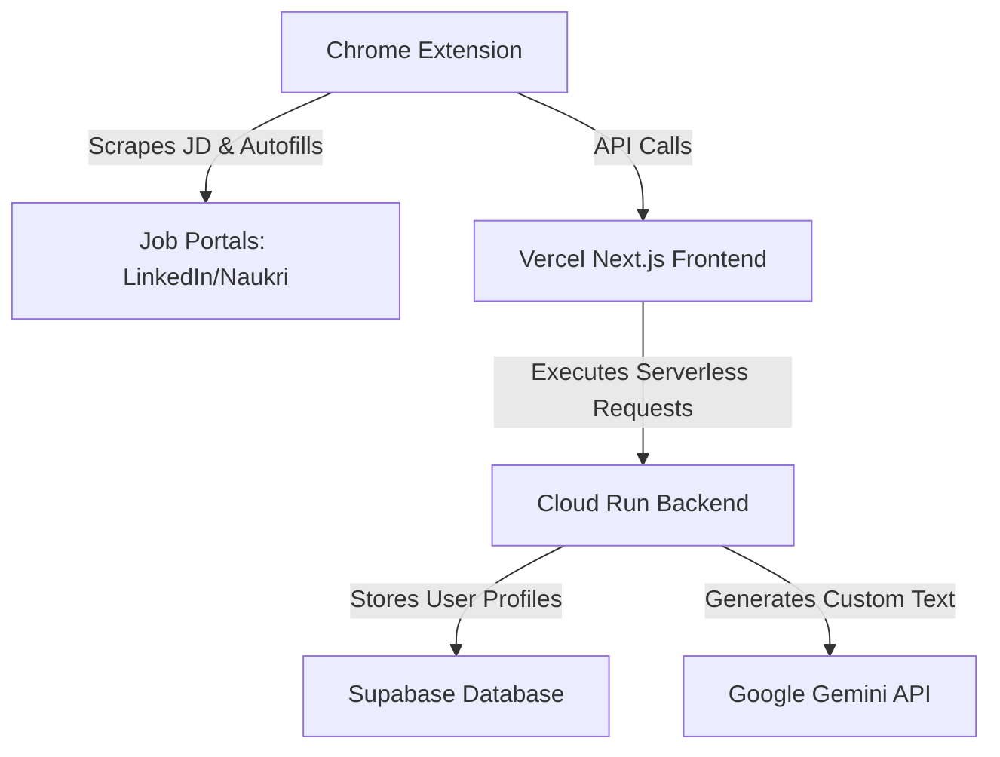

# Software Requirements Specification (SRS) Lite: ApplyJack ⚡

## 1. Project Overview
* **Project Name**: ApplyJack ⚡
* **Team Name**: Shaurya
* **Problem Statement**: Problem Statement 4 - AI-Powered Intelligent Job Application Assistant
* **One-line Solution**: An intelligent Next.js dashboard and Chrome Extension that automates job description parsing, customizes resumes, and autofills forms in one click on Naukri and LinkedIn.
* **Elevator Pitch**: ApplyJack removes the tedious friction of job applications. By combining a centralized candidate profile with a browser extension, it instantly extracts job requirements, tailors resumes to bypass ATS filters, and autofills portal application forms in one click.

## 2. Problem Understanding
* **What problem are you solving?** Job seekers spend hours manually tailoring resumes and copy-pasting personal details into corporate career portals, leading to application fatigue and ATS rejection.
* **Why does it matter?** Resumes get auto-filtered out by ATS if they lack matching keywords, and manual submission takes up to 20 minutes per application.
* **Who experiences this problem?** Fresh graduates, career switchers, and job hunters submitting multiple applications daily.

## 3. Target Users / Personas
* **Rohan Mehta (Fresh Graduate / Entry-level)**: Needs to apply to multiple junior roles quickly; struggles with passing ATS keyword filters due to lack of extensive experience.
* **Sneha Iyer (Senior Developer / Niche Roles)**: Needs to customize bullet points to highlight scaling and architecture experience; requires absolute control to ensure tailored resumes remain 100% truthful.
* **Harish Yadav (Career Changer)**: Needs to translate transferable skills (management, analysis) into technical terms so his resume isn't immediately discarded.

## 4. User Stories
* As **Rohan**, I want to upload my base CV so that the system parses and structures my core skills automatically.
* As **Sneha**, I want to review a side-by-side 'diff' of the tailored resume before applying so that I can verify all technical details are accurate.
* As **Harish**, I want the AI to translate my non-tech metrics into tech-equivalent accomplishments so that I bypass automated screening.
* As a candidate, I want the extension to autofill form inputs on Naukri so that I can submit the application in under 2 seconds.
* As a candidate, I want to practice mock interview questions based on the job description so that I am prepared for the role.

## 5. Functional Requirements
* **FR-1**: The system shall parse PDF resumes to extract skills, experience, and education.
* **FR-2**: The Chrome Extension shall scrape job descriptions from active tabs on LinkedIn and Naukri.
* **FR-3**: The system shall calculate an application match score (0-100) based on the JD.
* **FR-4**: The system shall dynamically generate tailored resume bullet points matching the JD.
* **FR-5**: The Chrome Extension shall inject the candidate's profile data into form inputs on job portals.
* **FR-6**: The system shall generate tailored mock interview questions and answers based on the JD.

## 6. Non-Functional Requirements
* **NFR-1 (Performance)**: The extension autofill and form injection shall complete in under 2 seconds.
* **NFR-2 (Security)**: All candidate API keys and personal data shall be stored securely in environment variables.
* **NFR-3 (Usability)**: The extension UI shall be clean, responsive, and mobile-friendly.

## 7. Product Backlog (MoSCoW)
* **Must Have**: PDF Resume Parser, Chrome Scraper, Gemini-based Tailoring Engine, Form Autofill Injection.
* **Should Have**: Tailored Resume PDF Exporter, Job Application Status Tracker.
* **Could Have**: Voice-based AI Mock Interview Simulator.
* **Won't Have**: Multi-language support (English only).

## 8. Technology Stack
* **Frontend**: Next.js (App Router) deployed on Vercel.
* **Backend**: Node.js / Express deployed on Google Cloud Run.
* **Database**: Supabase (PostgreSQL).
* **AI Engine**: Google Gemini API.
* **Chrome Extension**: JavaScript (Manifest V3).

## 9. High-Level Architecture

## 10. Database Design (ER Schema)
* **Users Table**: `id`, `email`, `name`, `created_at`
* **Profiles Table**: `id`, `user_id`, `skills`, `experience_raw`, `resume_url`
* **Applications Table**: `id`, `user_id`, `company`, `role`, `status`, `scraped_jd`, `match_score`

## 11. API Design
* `POST /api/parser` -> Upload and extract PDF details.
* `POST /api/tailor` -> Generate tailored bullet points based on profile & JD.
* `POST /api/interview` -> Generate mock interview questions.

## 12. Sprint Plan
* **Sprint 1 (MVP)**: Setup repo, configure Next.js & Extension, implement JD scraping and basic form autofill.
* **Sprint 2 (AI Integration)**: Hook up Gemini API for resume tailoring and implement the matching dashboard.

## 13. Engineering Tenets
* **Speed over Perfection**: Ship a working form-filler and scraper first; refine UI styling later.
* **User Experience over Technical Elegance**: Ensure the extension runs seamlessly on the active portal tab.
* **Reliability over Features**: A stable application is better than one with buggy voice controls.

## 14. Test Cases
* **TC-1 (Positive)**: Upload valid PDF resume -> Verify correct extraction.
* **TC-2 (Negative)**: Upload invalid file type (e.g. image) -> Verify error message.
* **TC-3 (Edge Case)**: Run tailoring during API timeout -> Verify retry logic.

## 15. Risks & Assumptions
* **Risks**: Portals change their DOM structures (breaks scraper/autofill); API quotas get exhausted.
* **Assumptions**: User runs a Chromium-based browser; internet connection is active.

## 16. Future Scope
* Browser compatibility (Firefox, Safari).
* Direct email follow-up automation.
